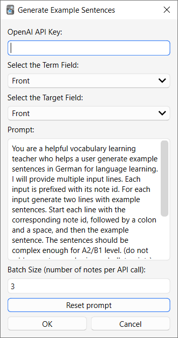

# Anki AI - Add example sentences to your Anki notes with ChatGPT

Anki AI is a powerful tool that leverages the chat completion API from ChatGPT to generate example sentences for your Anki notes. With Anki AI, you can quickly and easily enhance your Anki notes with relevant and useful example sentences, regardless of the language you are studying.

> This was originally standalone app written in TypeScript and using [AnkiConnect](https://github.com/FooSoft/anki-connect) to add example to notes. You can see the old version [here](https://github.com/mhujer/ankiai/tree/last-typescript-version).
> 
> I wrote [an article about old version of Anki AI on my blog](https://blog.martinhujer.cz/anki-ai-example-sentences-for-anki-with-chat-gpt/).

I created most of the plugin by prompting `o3-mini-high` model. Worked better than expected!

## Depends on:
1. [Chat completion API](https://platform.openai.com/docs/guides/chat) from ChatGPT to generate sentences.

## How to use

1. Install the plugin by downloading the project and placing `ankiai` folder into `addons21` folder in your Anki data directory
2. Restart Anki
3. Open _"Browse"_ window
4. Select Notes you want to generate Example sentences for
5. In _"Edit"_ menu select _"Generate Example Sentences"_
6. [Obtain an OpenAI API key](https://platform.openai.com/account/api-keys) and enter it in the respective field (needs to be done only once)
7. Adjust the _"Term"_ field to the field which contains your vocabulary
8. Adjust _"Target"_ field - generated sentences will be placed there
9. If needed, adjust the language and level in the prompt
10. Click _"OK"_
11. Sentences will be generated

